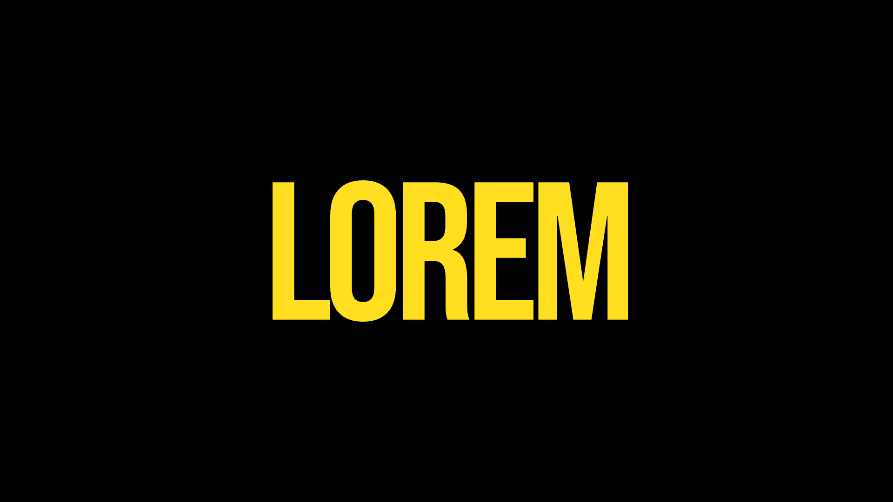

# All of the Lights



A Next.js single-page app that recreates the rapid-fire title-card intro
inspired by "Enter the Void" by Gaspar Noé and "All of the Lights" by
Kanye West and Rihanna: ~25 short text frames flashed at full viewport
with hard cuts (no fades, no transitions), each visually unrelated to
the prior one.

Stack: Next.js 16 (App Router) · React 19 · TypeScript · Tailwind v4 ·
`next/font/google`. No other dependencies — no Framer Motion, no animation
libs.

## Run

```bash
npm install
npm run dev
```

Open <http://localhost:3000>. The sequence starts as soon as the fonts
finish loading (a brief black screen before the first cut is expected).

## Playback controls

A floating control bar at the bottom of the player has restart,
prev, play/pause, next, the current frame indicator (`12 / 25`),
and a link to the settings page. It auto-hides after ~2.5s of no
mouse movement and reappears on any movement (or while paused).

Keyboard shortcuts:
- `space` — pause / resume
- `r` — restart from frame 0
- `→` / `n` — next frame (pauses)
- `←` / `b` — previous frame (pauses)

## Settings page

Visit `/settings` (or click the gear in the control bar) to:

- **Set the number of cards** — type a count, or use **+ Add card**.
  New cards get a randomized visual style.
- **Edit each card's text and duration** in place. Changes are saved
  to `localStorage` immediately and the player picks them up on its
  next mount (or live, if both pages are open).
- **Reorder, duplicate, or delete** any row.
- **Reshuffle styles** — re-rolls the visual style for one row, or for
  every card via the header button.
- **Reset** wipes your edits and restores the 25 hand-authored
  defaults from `app/frames.ts`.

The defaults in `app/frames.ts` remain the seed/baseline. User edits
are stored under `localStorage["lettering:frames:v1"]` and override
the seed.

## Add a frame in code

You can still edit `app/frames.ts` directly — that file is the seed
the app falls back to when no localStorage edits exist. Append a
`Frame` object to the `FRAMES` array. Example:

```ts
{
  text: "ENCORE",
  fontClass: "font-bungee",
  sizeClass: "text-[18vw]",
  colorClass: "text-yellow-300",
  bgClass: "bg-red-600",
  transformClass: "uppercase",
  rotateDeg: -8,
  durationMs: 220,
},
```

If two consecutive frames feel similar, **reorder them** — the chaos is
the whole point. Aim for at least three style axes to differ between
adjacent frames (font + color + size + alignment, etc.).

## Style axes

Every `Frame` field is a Tailwind class string (or a primitive):

| Field             | What it controls                              | Examples |
|-------------------|-----------------------------------------------|----------|
| `text`            | The displayed string                          | `"LIGHTS"`, `"a film by"`, `"!!!"` |
| `fontClass`       | Font family                                   | `font-bebas` `font-anton` `font-playfair` `font-inter` `font-major-mono` `font-space-mono` `font-bungee` `font-caveat` |
| `sizeClass`       | Font size                                     | `text-2xl` … `text-9xl`, `text-[18vw]`, `text-[40vw]` |
| `weightClass`     | Font weight (variable fonts only)             | `font-thin` `font-extralight` `font-light` `font-normal` `font-medium` `font-semibold` `font-bold` `font-extrabold` `font-black` |
| `colorClass`      | Text color (or stroke color when `strokeOnly`)| `text-white` `text-black` `text-red-600` `text-yellow-300` `text-lime-400` `text-blue-700` `text-pink-400` |
| `bgClass`         | Background color                              | `bg-black` `bg-white` `bg-red-600` `bg-yellow-300` `bg-lime-400` `bg-blue-700` `bg-pink-400` |
| `trackingClass`   | Letter-spacing                                | `tracking-tighter` … `tracking-widest`, `tracking-[0.4em]` |
| `transformClass`  | Text-transform                                | `uppercase` `lowercase` `normal-case` |
| `alignClass`      | Flex alignment for the frame                  | default centers; try `items-start justify-end` etc. |
| `paddingClass`    | Outer padding (useful with off-center align)  | `p-8` `p-12` `p-16` |
| `rotateDeg`       | Rotation in degrees                           | `-15` … `15`, occasionally `90` |
| `italic`          | Italicize                                     | `true` |
| `underline`       | Underline                                     | `true` |
| `strokeOnly`      | Outline-only text (transparent fill)          | `true` |
| `blendDifference` | `mix-blend-mode: difference`                  | `true` |
| `durationMs`      | How long this frame holds before swapping     | `120`–`350` typical, `500`–`900` for emphasis |

Add new families by:
1. Importing them in `app/layout.tsx` from `next/font/google` with a
   unique `variable` name.
2. Adding both the `variable` to the body `className` and the
   `--font-foo` mapping under `@theme` in `app/globals.css`.

Tailwind v4 scans `app/frames.ts` (declared via `@source` in
`globals.css`) so any class literal that appears in that file is
generated automatically — no separate safelist required. Classes
*composed at runtime* must therefore exist as full literal strings in
`frames.ts`.

## Reduced motion

If `prefers-reduced-motion: reduce` is set, every frame holds for at
least 1.5 seconds and rotations are zeroed out.
